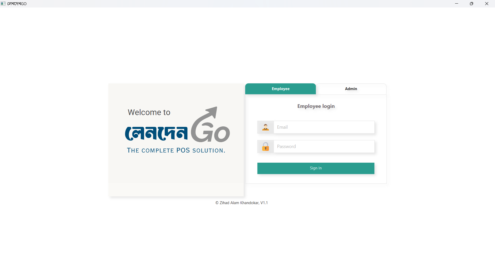

# 💼 LendenGo (লেনদেনGO) – Modern POS System


**LendenGo** is a modern GUI-based Point of Sale (POS) system built using **Java** and **JavaFX**, powered by a **MySQL** backend.  
It’s designed to make business transactions simple, efficient, and visually engaging — supporting both **Admin** and **Employee** operations.

---

## 🚀 Current Progress

### ✅ Completed:
- **Login Page**
    - Supports both Admin and Employee logins.
    - Validates credentials against the MySQL `lendengo` database.
- **Database Setup**
    - **Database Name:** `lendengo`
    - **Table:** `users`
    - **Columns:**
        - `name` VARCHAR(200)
        - `email` VARCHAR(90)
        - `password` VARCHAR(20)
        - `role` VARCHAR(10)
- **Admin Dashboard (In Progress)**
    - Includes a **sidebar menu** with animated submenus.
    - Displays **store name** and **logged-in user details** at the top.
    - Header partially completed (includes Logout option).
    - Similar layout planned for Employee dashboard (with limited access).

---

## 🔐 Sample Login Credentials

| Role | Email | Password |
|------|--------|-----------|
| **Admin** | abc@gmail.com | 123abc |
| **Employee** | employeeemail@gmail.com | abc123 |

---

## 🧭 Dashboard Menu Structure

<details>
  <summary>(Click to Expand)</summary>

### Main Menus & Submenus
1. **Dashboard**
2. **Point of Sell**
3. **Sell**
    - Sell List
    - Return List
    - Sell Log
4. **Quotation**
    - Add Quotation
    - Quotation List
5. **Installment**
    - Installment List
    - Payment List
    - Payment Due
    - Overview Report
6. **Purchase**
    - Add Purchase
    - Purchase List
    - Return List
    - Purchase Log
    - Stock Import
7. **Stock Transfer**
    - Add Transfer
    - Transfer List
    - Receive List
8. **Product**
    - Product List
    - Add Product
    - Category List
    - Add Category
    - Import
    - Stock Alert
9. **Customer**
    - Add Customer
    - Customer List
10. **Supplier**
    - Add Supplier
    - Supplier List
11. **Accounting**
    - Deposit
    - Withdraw
    - Transaction List
    - Transfer Balance
    - Transfer List
    - Add Bank Account
    - Bank Account List
    - Income Source
    - Balance Sheet
    - Income (Monthwise)
    - Expense (Monthwise)
    - Income vs Expense
    - Profit vs Loss
    - Cashbook
12. **Expenditure**
    - Add Expense
    - Expense List
    - Add Category
    - Category List
    - Expense (Monthwise)
    - Summary
13. **Loan Manager**
    - Loan List
    - Take Loan
    - Summary
14. **Reports**
    - Overview Report
    - Collection Report
    - Due Collection Report
    - Due Paid Report
    - Sell Report
    - Purchase Report
    - Sell Payment Report
    - Purchase Payment Report
    - Sell Tax Report
    - Purchase Tax Report
    - Tax Overview Report
    - Stock Report
15. **Analytics**
16. **User Management**
    - Add User
    - User List
    - Add Usergroup
    - Usergroup List
    - Login History

</details>


---

## 🛠️ Technologies Used

- **Java (JDK 17+)**
- **JavaFX**
- **MySQL**
- **CSS**
- **FontAwesome**
- **JDBC** (for database connectivity)

---

## 🔮 Upcoming Features

- Complete Admin Dashboard with full menu navigation
- Employee Dashboard Interface
- CRUD operations for user, product, and transaction management
- Reporting and Analytics modules
- Improved animations and theme customization

---

## 👨‍💻 Developer

**MD. Zihad Alam Khandokar**

> “LendenGo” (লেনদেনGO) — derived from the Bangla word *লেনদেন* (meaning *Transaction*), symbolizing an easy and smart way to manage transactions on the go.

---

## 🧩 Project Status
🚧 **In Development** – Core UI and login system completed, dashboard construction in progress.

---

## 🧩 System Requirements

Before running **LendenGo**, make sure your environment meets the following requirements:

| Component | Version / Requirement                            | Description |
|------------|--------------------------------------------------|--------------|
| **Java Development Kit (JDK)** | **18** or later (Amazon Corretto 18 recommended)| Required to compile and run the JavaFX application. |
| **JavaFX SDK** | Compatible with JDK 18                           | Used for building the graphical user interface. |
| **MySQL Server** | 8.0 or later                                     | Stores user and POS-related data. |
| **MySQL Connector/J (for Maven)** | **8.2.0**                                        | JDBC driver for connecting JavaFX with MySQL. |
| **FontAwesomeFX** | **4.7.0-9.1.2**                                  | Provides modern icons for buttons and menu items. |
| **IDE** | IntelliJ IDEA (Recommended) / Eclipse / NetBeans | For project management, building, and debugging. |

---

## 🧱 Dependencies (Maven Configuration)

Add the following dependencies to your `pom.xml` file to ensure proper integration with MySQL and FontAwesomeFX:

```xml
<!-- https://mvnrepository.com/artifact/com.mysql/mysql-connector-j -->
<dependency>
    <groupId>com.mysql</groupId>
    <artifactId>mysql-connector-j</artifactId>
    <version>8.2.0</version>
</dependency>

<!-- https://mvnrepository.com/artifact/de.jensd/fontawesomefx-fontawesome -->
<dependency>
    <groupId>de.jensd</groupId>
    <artifactId>fontawesomefx-fontawesome</artifactId>
    <version>4.7.0-9.1.2</version>
</dependency>
```

---

## ⚙️ How to Run the Project

1. **Clone this Repository**
   ```bash
   git clone https://github.com/Khandokarzihad/lendenGo.git
   ```
2. **Import the Project**  
Open the project in your preferred IDE — such as **IntelliJ IDEA**, **Eclipse**, or **NetBeans** — and ensure **JavaFX** is properly configured in your environment.


3. **Set Up the MySQL Database**

```sql
CREATE DATABASE lendengo;
USE lendengo;

CREATE TABLE users (
    name VARCHAR(200),
    email VARCHAR(90),
    password VARCHAR(20),
    role VARCHAR(10)
);
```
4. **Insert Sample Users**

```sql
INSERT INTO users VALUES
('Admin', 'abc@gmail.com', '123abc', 'admin'),
('Employee', 'employeeemail@gmail.com', 'abc123', 'employee');
```

5. **Run and Test**  
Launch the application from your IDE and test the login functionality using the sample credentials.
If the login is successful, you’ll be redirected to the respective Admin or Employee dashboard.

---
## 🏷️ License

This project is licensed under the **GNU General Public License v3.0 (GPLv3)**.  
For full details, see the [LICENSE](LICENSE) file.

---
## 📷 Screenshots


---

## ⭐ If you find this project helpful, don’t forget to give it a star on GitHub!